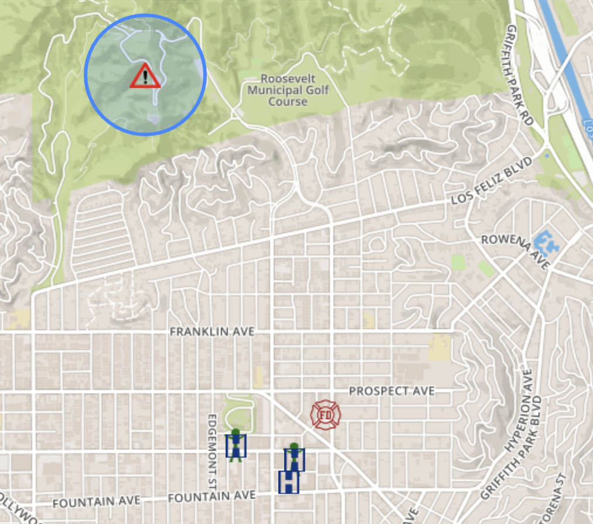

# EmComMap
## Live multi-user annotatable map for emergency communications



### Features
* Interactive map with symbols for operators, locations, and incidents
* Incidents defined by geographic region and time
* Text-based message traffic with associated precedence (e.g. priority, emergency)
* Attach files to messages
* Operator status reports
* Location status reports
* Tactical call signs
* Upload locations by latitude/longitude
* Download message logs
* Message sorting and location filtering
* Persistent storage on server database, with replication

### Deployment
* Can be encrypted (https) or unencrypted (http, suitable for Amateur Radio)
* MESH networking
* Internet / intranet
* Relies on three server platforms, each of which can be deployed redundantly to avoid single points of failure:
  1. CouchDB
  2. Map tile server
  3. Web server (e.g. Apache2)

### User manual
* See [EmComMap User Guide](html/Documentation/EmComMap_user_guide.pdf)

### Installation (Ubuntu Linux)

This installation method has been tested on Ubuntu 16.04.5 (xenial). The process is not particularly pleasant, and if others have suggestions on how to improve it, please contact me.

#### CouchDB database (http://couchdb.apache.org/)

Install CouchDB (v1.6.0 tested)

`$ sudo apt install couchdb`

Edit the file /etc/couchdb/local.ini, for example using
`$ sudo vi /etc/couchdb/local.ini`

1. Insert the line:
```enable_cors = true```
beneath the line that reads
```[http]```
(note in newer versions this may be 'httpd' instead of 'http')

1. Add the following lines to the end of the file:
```[cors]
origins = *
credentials = true
methods = GET, PUT, POST, HEAD, DELETE
headers = accept, authorization, content-type, origin, referer, x-csrf-token
```
Restart CouchDB:
`$ sudo /etc/init.d/couchdb restart`

Note: With newer versions of CouchDB you may need to insated enable CORS through the CouchDB web configuration console, setting origins to "*".

===================================================================================================================
#### Install CouchDB (v3.0+)

These RedHat-style rpm packages and Debian-style deb packages will install CouchDB at /opt/couchdb and ensure CouchDB is run at system startup
 by the appropriate init subsystem (SysV-style initd or systemd).

Enabling the Apache CouchDB package repository
'$ sudo apt update && sudo apt install -y curl apt-transport-https gnupg'
'$ curl https://couchdb.apache.org/repo/keys.asc | gpg --dearmor | sudo tee /usr/share/keyrings/couchdb-archive-keyring.gpg >/dev/null 2>&1 \
    source /etc/os-release'
'$ echo "deb [signed-by=/usr/share/keyrings/couchdb-archive-keyring.gpg] https://apache.jfrog.io/artifactory/couchdb-deb/ ${VERSION_CODENAME} main" \
    | sudo tee /etc/apt/sources.list.d/couchdb.list >/dev/null'

Installing the Apache CouchDB packages
'$ sudo apt update'
'$ sudo apt install -y couchdb'
===================================================================================================================

Set up databases using web configuration tool. Direct your browser to
`http://<host>:5984/_utils/`, where `<host>` is the hostname or IP address
  of the CouchDB server

1. Set an admin password. A link in the lower right-hand corner of the web page should give you the option of setting an administrator password.

1. Verify the installation. There is a link to do this on the right hand side of the page, below *Diagnostics*.

1. Create databases for EmComMap.
   * Click *Overview*, which is below *Tools* on the right hand side
   * On the upper left, click *Create Database*
   * Create a database called *emcommap*
   * Using the same method, create a second database called *emcommap_attachments*

To create users:
1. Click *Overview*, which is below *Tools* on the right hand side
1. On the left, you will see a link to the database *_users*. Click on it.
1. Click *New Document* on the upper left, which will bring up a document containing one line
1. Click the *Source* tab on the upper right
1. Double-click on the document to get into edit mode, and replace the document's text with the following:

   ```
   {
   "_id": "org.couchdb.user:username",
   "name": "name_of_user",
   "type": "user",
   "roles": [],
   "password": "plaintext_password"
   }
   ```
1. In the text, replace *username* with the desired user name, *name_of_user* with the user's name, and *plaintext_password* with the user's password (it will be stored as a hash, not in plain text).
1. Click *Save Document* in the upper left corner

You must give each user that you create permission to access the EmComMap databases, as follows:
1. Go to *Overview* (below the *Tools* menu on the right).
1. Click on the database *emcommap*
1. Click on *Security* at the top
1. You will add to the *Members* area of the dialog which pops up. In the *Names* field you will fill in all user names using the following format: `["user1","user2","user3"]`
1. Click *Update* to complete.
1. Repeat these same steps for the database *emcommap_attachments*

Note: It has been reported that you may need to add users one at a time to get this to work.

#### Apache2 web server (https://httpd.apache.org/)

Note that while Apache2 is used in this example, other web servers should perform just as well.

Install the apache2 web server:
`$ sudo apt install apache2`

Download EmComMap
`$ cd /var/www/html`
`$ sudo git clone https://github.com/DanRuderman/EmComMap.git`

Restart the apache2 web server
`$ sudo apache2ctl restart`

#### Map tile server (https://github.com/klokantech/tileserver-gl)

Create a directory for the tile server data:
`$ sudo mkdir /usr/local/tileserver-gl`
`$ cd /usr/local/tileserver-gl`

Download map tiles from [OpenMapTiles](https://openmaptiles.com/downloads/planet/). You can download the entire planet or just a region of interest by navigating to that location. For this exmple we will download the Los Angeles region. Whichever geographic area you choose, you will want to download the *OpenSteetMap* tiles. Note you will need to create an account to download tiles. OpenMapTiles will provide you a *wget* command to download. Download into the directory you created above (e.g. */usr/local/tileserver-gl*).

`$ sudo wget -c https://openmaptiles.com/download/<TOKEN>/osm-2017-07-03-v3.6.1-california_los-angeles.mbtiles?usage=personal -O osm-2017-07-03-v3.6.1-california_los-angeles.mbtiles`

Install docker:
`$ sudo apt install docker.io`

Run the tile server (must be in the directory containing the tiles, e.g. */usr/local/tileserver-gl*):
`$ sudo docker run --rm -it -v $(pwd):/data -p 8080:80 klokantech/tileserver-gl`

The first time this is run, the docker container for *tileserver-gl* will be downloaded and extracted. This will take significant time (perhaps 30 minutes). When initialization has complete and the tile server is active, it will print: *Startup complete*. At this point it will be serving tiles over port 8080 using the unencrypted http protocol.

To test that the tile server is functional, enter the following URL into your browser:
`http://<host>:8080/styles/klokantech-basic/0/0/0.png`(substituting your host name for `<host>`). It should bring up a single tile of the world.

It is useful to place the above docker command into a shell script, and possibly have it run automatically on reboot via the */etc/init.d* mechanism. Documentation on *tileserver-gl* can be found [here](https://tileserver.readthedocs.io/en/latest/).

===================================================================================================================

Create a systemd service.

'$ sudo nano /etc/systemd/system/klokantech.service'

[Unit]
Description=Start KloKan Tech Server

[Service]
ExecStart=/path/to/klokantech.sh

[Install]
WantedBy=multi-user.target

Create the klokantech.sh file

'$ cd /path/to/
'$ nano klokantech.sh'

#! /bin/bash
cd /usr/local/tileserver-gl
docker run -d --rm -it -v $(pwd):/data -p 8080:80 klokantech/tileserver-gl`

'$ chmod +x klokantech.sh

Enable the service

'$ sudo systemctl enable klokantech'

Check status of klokantech service

'$ sudo systemctl status klokantech'

===================================================================================================================

### Configuration

#### EmComMap configuration

To configure your installation, edit the file */var/www/html/EmComMap/html/config.js*. Toward the top of the file you will see these lines:

```
const RUN_LOCATION = "local";

if(RUN_LOCATION == "my-install") {
    var TILE_SERVER = 'http://<host>:8080/styles/klokantech-basic/{z}/{x}/{y}.png';
    var TILE_SERVER_OPTS = {
	maxZoom: 18,
	attribution: 'Map data &copy; <a href="https://www.openstreetmap.org/">OpenStreetMap</a> contributors, ' +
	    '<a href="https://creativecommons.org/licenses/by-sa/2.0/">CC-BY-SA</a>, ' +
	    'Server courtesy of <a href="https://openmaptiles.com/">OpenMapTiles</a>'
    };
    var DEFAULT_DB_HOST = '<host>';
```

Within them, change the following:
1. Change the RUN_LOCATION string to *my-install* instead of *local*
1. Change both instances of `<host>` to the name or IP address of your EmComMap server. Note that if you have the CouchDB server on a different computer, then use that computer's address for *DEFAULT_DB_HOST*.

Set the value of `ADMIN_EMAIL` to be the email address for credentials requests.

Additionally, if your deployment is for testing only set the value of `TEST_MODE` to `true` in `config.js`. This will put the text TESTING in bold red font at the top of the application and precede all messages with "TESTING:". The purpose is to ensure that test traffic is not mistaken for a real-world emergency.

#### Database replication
Although I have not attempted it, it should be straightforward to replicate the CouchDB databases across servers, thus providing a route to failover. Please consult the CouchDB documentation on how to achieve this.

### Note on encryption and Amateur Radio use
Amateur radio based applications (e.g. supporting MESH networking) may not encrypt data transmissions.

* [CouchDB does not by default enable encryption](https://stackoverflow.com/questions/44585302/what-encryption-mechanism-is-used-in-couchdb), as it uses the http rather than the https protocol. The relevant lines in the configuration files (*/etc/couchdb/default.ini* and */etc/couchdb/local.ini*) contain the text `httpsd`, and are by default commented out. The default port for CouchDB's https encrypted communications is 6984, so if you run the command `$ netstat -plnt  | grep 6984`, you should see no output unless CouchDB is listening on an https socket. If you wish to enable SSL based encryption, see [this article](https://cwiki.apache.org/confluence/pages/viewpage.action?pageId=48203146).

* Apache2 does not by default enable encryption over SSL. To check that the SSL port (443) is not open, run the command `$ netstat -plnt  | grep apache2`, which should only show a line for port 80 and not for port 443. If you wish to disable SSL, comment out any lines containing `Listen 443` in the file */etc/apache2/ports.conf*.

* Tileserver-gl as installed above does not use encryption.

### Thanks to those who kindly provided the open source libraries leveraged by EmComMap:
* [Leaflet](https://leafletjs.com/)
* [FileSaver.js](https://github.com/eligrey/FileSaver.js/)
* [filesizejs](https://filesizejs.com/)
* [jquery-timepicker-ui-addon](https://www.npmjs.com/package/jquery-ui-timepicker-addon)
* [tablesorter](https://github.com/Mottie/tablesorter)
* [js-cookie](https://github.com/js-cookie/js-cookie)
* [moment.js](https://momentjs.com/)
* [PouchDB](https://pouchdb.com/)
* [smart-time-ago](https://github.com/pragmaticly/smart-time-ago)
* [xlsx-populate](https://github.com/dtjohnson/xlsx-populate/tree/master/browser)

### Dan Ruderman (K6OAT) emcommap@gmail.com
